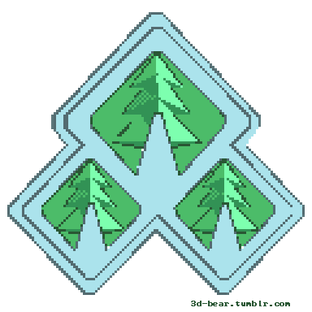

![bg][banner-JairTorres1003]

---
<!-- nav -->

  <picture>
    <source media="(prefers-color-scheme: dark)" srcset="https://raw.githubusercontent.com/JairTorres1003/JairTorres1003/output/github-contribution-grid-snake-dark.svg">
    <source media="(prefers-color-scheme: light)" srcset="https://raw.githubusercontent.com/JairTorres1003/JairTorres1003/output/github-contribution-grid-snake.svg">
    
  </picture>

---

  
  
  
  
  
  
  
  
  

<h1 align="center">
  <a href="#user-content-GitHub-Profile-Status">
    <picture>
      
    </picture>
    GitHub Profile Status
    <picture>
      
    </picture>
  </a>
</h1>

  <picture>
    <source media="(prefers-color-scheme: dark)" srcset="https://github-readme-streak-stats.herokuapp.com?user=JairTorres1003&theme=github-dark-blue&hide_border=true&date_format=j%20M%5B%20Y%5D">
    <source media="(prefers-color-scheme: light)" srcset="https://github-readme-streak-stats.herokuapp.com?user=JairTorres1003&date_format=j%20M%5B%20Y%5D">
    
  </picture>

  <picture>
    <source media="(prefers-color-scheme: dark)" srcset="https://github-readme-stats-jairtorres1003.vercel.app/api/top-langs/?username=JairTorres1003&layout=compact&theme=github_dark">
    <source media="(prefers-color-scheme: light)" srcset="https://github-readme-stats-jairtorres1003.vercel.app/api/top-langs/?username=JairTorres1003&layout=compact">
    
  </picture>
  <picture>
    <source media="(prefers-color-scheme: dark)" srcset="https://github-readme-stats-jairtorres1003.vercel.app/api?username=JairTorres1003&show_icons=true&theme=github_dark">
    <source media="(prefers-color-scheme: light)" srcset="https://github-readme-stats-jairtorres1003.vercel.app/api?username=JairTorres1003&show_icons=true">
    
  </picture>

<h1 align="center">
  <a href="#user-content-GitHub-Profile-Trophy">
    <picture>
      
    </picture>
    GitHub Profile Trophy
    <picture>
      
    </picture>
  </a>
</h1>

  <picture>
    <source media="(prefers-color-scheme: dark)" srcset="https://github-profile-trophy.vercel.app/?username=JairTorres1003&no-frame=true&theme=onestar&margin-w=7&margin-h=5&column=8">
    <source media="(prefers-color-scheme: light)" srcset="https://github-profile-trophy.vercel.app/?username=JairTorres1003&no-frame=true&margin-w=7&margin-h=5&column=8">
    
  </picture>

<h1 align="center">
  <a href="#user-content-Languages-and-Tools">
    <picture>
      ">
    </picture>
    Languages and Tools
    <picture>
      ">
    </picture>
  </a>
</h1>

  
  <code></code>
  
  <code></code
  
  <code></code>
  
  <code></code>
  
  <code></code>
  
  <code></code>
  
  <code></code>
  
  <code></code>
  
  <code></code>
  
  <code></code>
  
  <code></code>
  
  <code></code>
  
  <code></code>
  
  <code></code>
  
  <code></code>
  
  <code></code>
  
  <code></code>
  
  <code></code>
  
  <code></code>
  
  <code></code>
  
  <code></code>
  
  <code></code>
  

<h1 align="center">
  <a href="#user-content-Badges">
    <picture>
      
    </picture>
    Badges
    <picture>
      
    </picture>
  </a>
</h1>

<h1 align="center">
  <a href="#user-content-Contact">
    <picture>
      
    </picture>
    Contact
    <picture>
      
    </picture>
  </a>
</h1>

  
  
  
  
  
  
  
  
  
  
  
  
  

--- 
![bg][footer-JairTorres1003]

<!-- variables banner and footer-->
<!--
[banner-JairTorres1003Dog]: ./JairTorres1003Dog.jpg
[banner-JairTorres1003Tec]: ./code-jairTorres.jpg
-->
[banner-JairTorres1003]: ./icon/banner.jpg
[footer-JairTorres1003]: ./icon/footer.png

<!-- REFERENCES --
https://github.com/Platane/snk
https://github-readme-streak-stats.herokuapp.com/demo/
https://github.com/anuraghazra/github-readme-stats
https://github.com/ryo-ma/github-profile-trophy
-->
  
<!-- Copyright © 2022 Jair Torres. -->
