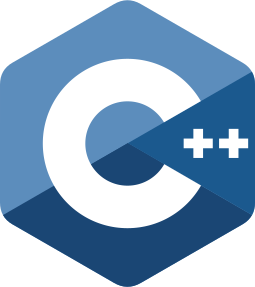

![bg][banner-JairTorres1003]

---
<!-- nav -->
<!---->

---
<h1 align="center">
  
  GitHub Profile Status
  
</h1>

  

  
  

---
<h1 align="center">
  
  GitHub Profile Trophy
  
</h1>

  

---
<h1 align="center">
  ">
  Languages and Tools
  ">
</h1>

  <code></code>
  
  <code></code
  
  <code></code>
  
  <code></code>
  
  <code></code>
  
  <code></code>
  
  <code></code>
  
  <code></code>
  
  <code></code>
  
  <code></code>
  
  <code></code>
  
  <code></code>
  
  <code></code>
  
  <code></code>
  
  <code></code>
  
  <code></code>
  
  <code></code>
  
  <code></code>
  
  <code></code>

---
<h1 align="center">
  
  Contact
  
</h1>

  
  
  
  
  
  
  
  
  
  
  

--- 
![bg][footer-JairTorres1003]

<!-- variables banner and footer-->
<!--
[banner-JairTorres1003Dog]: ./JairTorres1003Dog.jpg
[banner-JairTorres1003Tec]: ./code-jairTorres.jpg
-->
[banner-JairTorres1003]: ./icon/banner.jpg
[footer-JairTorres1003]: ./icon/footer.png

<!-- REFERENCES --
https://github.com/Platane/snk
https://github-readme-streak-stats.herokuapp.com/demo/
https://github.com/anuraghazra/github-readme-stats
https://github.com/ryo-ma/github-profile-trophy
-->
  
<!-- Copyright © 2022 Jair Torres -->
